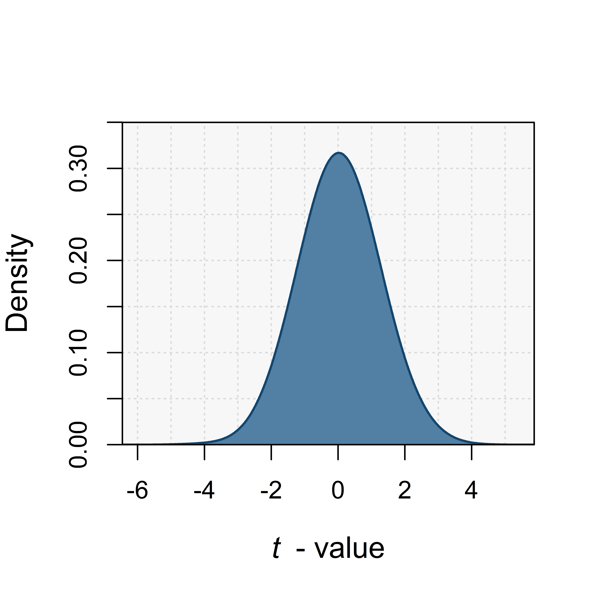

<script type="text/javascript" src="http://cdn.mathjax.org/mathjax/latest/MathJax.js?config=TeX-AMS-MML_HTMLorMML"></script> <script type="text/x-mathjax-config"> MathJax.Hub.Config({ tex2jax: {inlineMath: [['$', '$']]}, messageStyle: "none" }); </script>

# Null models in ecology

## What is a null model?

Baseline stats courses will teach you how to test hypotheses using classic parametric tests such as $t$-tests or ANOVAs. These tests are said to be parametric because they rely on assumptions regarding the nature of the data. For Student's $t$-test, this means we assume:

1. A normally-distributed continuous variable within the statistical population from which we draws our two groups
2. Equal variance between groups
3. Groups being formed by randomly chosen units/individuals

If we do meet these assumptions, and we draw two random groups from a given population, the metric $t$ should be fairly close to 0. And in fact, the density function of the $t$-distribution is known. This means we know what should be the probability of getting a $t$-value with a value of $X$ (i.e., that far from our theoretical value of 0) simply by chance. This is at the basis on hypothesis-testing for the $t$-test: we have two groups, we measure a $t$-value representing the amount of difference between the groups, and we determine what was the probability of obtaining a $t$-value that far from 0 if these two groups actually come from the same statistical population. If the probability is very low, this means we have some confidence that our two groups do **not** come from the same population: they are thus considered "distinct". And if we simulate a homogeneous population, and truly draw randomly two groups from it to calculate a $t$-value, and repeat the process many many times, we will indeed get a distribution that looks quite alike to the "real" $t$-distribution:

```r
nsim=1000
pop=rnorm(10000,0,1)
size=30
x=lapply(1:nsim,function(size){
	gr1=sample(pop,size)
	gr2=sample(pop,size)
	t=(mean(gr1)-mean(gr2))/sqrt(var(gr1)/size+var(gr2)/size)
	return=t})
rand_t=sapply(x,'[',1)
d=density(na.omit(rand_t),bw=.75)

png("t.test.png",res=1200,units="in",height=4,width=4)
plot(d$y~d$x,type="l",ylab="Density",xlab=expression(italic(t)~" - value"),xaxs="i",yaxs="i",ylim=c(0,.35),col="NA",cex.lab=1.2)
rect(-10,-5,10,1,col="grey97",border=NA)
abline(v=seq(-6,6,1),lty=3,col="grey86")
abline(h=seq(0,.4,.05),lty=3,col="grey86")
polygon(c(d$x,d$x[1]),c(d$y,d$y[1]),col="#5280A4",border=NA)
lines(d$y~d$x,col="#13466E",lwd=1.5)
box()
dev.off()
```
<p align="center">
</p>

<br>

**BUT**, all this process of the $t$-test relies on the fact that you **know** what should be the distribution of your $t$-value simply by chance. What if you have **NO IDEA** of what should random $t$-values in your study system look like? This is when null models come in handy.

<br><br>

## Null models in community ecology
Let's exemplify the concept of null models with the idea of species segregation in a meta-community. This old idea has gained much traction in the 1970's when the idea of a checkerboard distribution was first evoked by Diamond (1975). [Stone & Robert (1990)](https://doi.org/10.1007/BF00317345) translated this concept into a "checkerboardness" score, or $C$-score metric. 

At the metacommunity level, checkerboardness would mean that some species can **never** co-occur together, possibly due to strong competition, or to very strong environmental filtering. This would translate into a high $C$-score. However, the $C$-score will also be influenced by the total amount of occurrence in a meta-community. If the matrix if almost filled with 1's (many many occurrences of many many species all over the place), it will be harder to get checkerboard patterns. Thus, just by chance, the $C$-score may be higher when the matrix has more 1's (e.g., [Chagnon et al. 2016](https://doi.org/10.1007/s00442-015-3457-5)). 

More importantly, you could never get a statistical distribution of what the $C$-score value of any matrix should be just by chance. It depend on the matrix size, rows vs columns, fill, etc. It means that each matrix has its own specific random distribution of potential $C$-score values. So if you were to determine whether the actual $C$-score value that you measured for your metacommunity is higher, or lower, than what should be expected just by chance, you would need to **calculate yourself** the statistical distribution of the $C$-score for your matrix. This is the very essence of a null model! You shuffle your initial matrix (or any form of data you have and want to get )

<br><br>

## Constraints in a null model
When generating random scenarios, we must think about the level of constraints we want to impose to these scenarios. Let's exemplify this with our $C$-score case. Let's import the dataset ``Safariland`` from the R package ``bipartite``. It represents a bipartite network, with pollinators (columns) found visiting different plant species (rows). We could be interested in quantifying the $C$-score of such network to determine whether pollinators show evidence of a checkerboard pattern, where some pollinators are never found visiting the same plants... 

```r
library(bipartite)
data(Safariland)
m=Safariland
m[m>0]=1>
```

We now have this matrix ``m`` that contains the data. In the last line, we transform the dataset into its binary form, because $C$-score works with 1's and 0's. 

The nice thing about the package ``bipartite`` is that is already contains a built-in function to compute $C$-score: ``C.score``. If we calculate the $C$-score of our initial dataset, ``C.score(m)``, we get an **observed value** of 0.56. Now, let's build null matrices to compare this observed value to **random values**. Let's explore 3 level of constraints:

1. No constraint at all, simply draw 0's and 1's randomly with a probability $p$ (let's use $p=0.5$)

<br>

```r
rand1=function(m){matrix(rbinom(nrow(m)*ncol(m),1,.5),nc=ncol(m))}
```
<br>

2. Constrain the number of 0's. In #1 above, we draw 1's with a 0.5 probability, but we know in fact that the probability of getting a 1 in the real matrix is ``sum(m)/(nrow(m)*ncol(m))``, which equals 0.16. We could thus randomly draw 1,s with a probability $p$ of 0.16. Alternatively, to be very sure to get the exact same number of occurrences as in ``m``, we could shuffle a vector with 39 1's (``sum(m) = 39``) and 204 0's (the remaining cells that are not 1's in ``m``)

<br>

```r
rand2=function(m){matrix(sample(c(rep(1,sum(m)),rep(0,(nrow(m)*ncol(m)-sum(m)))),nrow(m)*ncol(m),replace=F),nc=ncol(m))}
```

<br>

3. Maybe we want also to acknowledge the fact that some plants have much more pollinators than others...? So we want to make sure that all rows have the same number of 1's in the simulated matrix?

<br>

```r
### Define a function to apply to each row where we just resample each row vector
xx=function(x){sample(x,length(x))}

### Apply this to all rows in our matrix
rand3=function(m){t(apply(m,1,xx))}
   
```

<br>

4. Alternatively, we might want to constrain the number of plant each pollinator visits?

<br>

```r
### Define a function to apply to each row where we just resample each row vector
xx=function(x){sample(x,length(x))}

### Apply this to all rows in our matrix
rand4=function(m){apply(m,2,xx)}
   
```

<br>

5. Finally, we might to constrain **both** rows and column totals. Here the package "bipartite" is quite useful because it has a built-in function that does so:

<br>

```r
rand5=function(m){swap.web(1,m)}
```

<br>

Let's now compare these 5 different avenues to generate null matrices:


<br>

```r
l=rep(list(m),100)
null_rand1=lapply(l,rand1)
null_rand2=lapply(l,rand2)
null_rand3=lapply(l,rand3)
null_rand4=lapply(l,rand4)
null_rand5=lapply(l,rand5)
```

<br>

The last one is a bit longer to run, because due to the high constraints in the calculations, it must look longer for alternative configurations of ``m`` that meet the criteria we have...

Now that we have lists of null matrices, we can compute the $C$-score for each of these null matrices:

<br>

```r
C_rand1=sapply(lapply(null_rand1,C.score),'[',1)
C_rand2=sapply(lapply(null_rand2,C.score),'[',1)
C_rand3=sapply(lapply(null_rand3,C.score),'[',1)
C_rand4=sapply(lapply(null_rand4,C.score),'[',1)
C_rand5=sapply(lapply(null_rand5,C.score),'[',1)
```